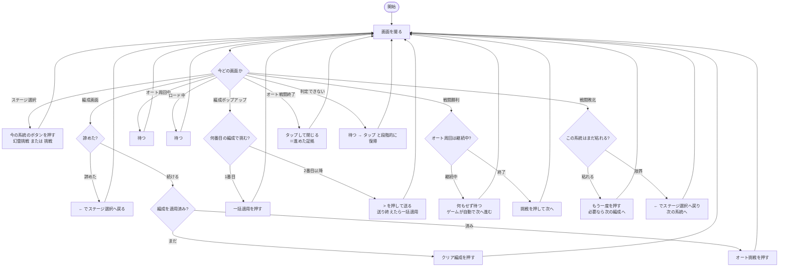

# AFK Journey 先鋒ステージ 自動操作ツール

PC版 AFK Journey の「先鋒ステージ」周回を自動化します。
**幻霊先鋒ステージとシーズン先鋒ステージの両方**を、それぞれ限界まで粘って回します。

```bash
afkj doctor     環境を診断する（最初にこれ）
afkj capture    ゲーム画面を撮影する（F9で保存 / F10で終了）
afkj crop       スクショからテンプレート画像を切り出す
afkj check      今の画面に各テンプレートがどれだけ一致するか調べる
afkj run        自動操作を開始する
```

### 呼び出し方

`afkj` は PATH に入っていないので、**このフォルダ直下で `afkj.bat` を呼びます。**
以下このドキュメントでは `afkj ...` と書きますが、実際の入力はこうなります。

| ターミナル | 入力 | |
|---|---|---|
| PowerShell | `.\afkj.bat run` | 実行確認済み |
| Git Bash | `./afkj.bat run` | 実行確認済み |
| cmd | `afkj.bat run` | |

> カレントディレクトリを実行パスから外す設定（環境変数
> `NoDefaultCurrentDirectoryInExePath`）が入っている環境では、`.\` を
> 付けない `afkj.bat run` は「認識されていません」と言われます。
> 先頭に `.\`（Git Bash なら `./`）を付けてください。

Python 自体が PATH に無くても構いません（`afkj.bat` が実体を探します）。
`.venv\Scripts\python.exe` があればそちらを優先します。

---

## セットアップ

### 1. Python

https://www.python.org/downloads/ から 3.9 以上をインストール。
**PATH に通っていなくても構いません** — `afkj.bat` が実体を自動で探します。

### 2. ライブラリ

```bash
pip install opencv-python numpy pillow
```

### 3. 環境の確認

```bash
afkj doctor
```

Python・ライブラリ・管理者権限・DPI・ゲームウィンドウをまとめて確認します。

> ⚠ **管理者権限が必要です。**
> 通常権限だとクリックがゲームに届きません。ターミナルを右クリック →
> 「管理者として実行」で開いてください。

### 4. 画面の撮影

```bash
afkj capture
```

起動したら**ターミナルに戻らず、そのままゲームをプレイするだけ**です。
画面が切り替わって落ち着いたタイミングを自動で見つけて `screenshots/` に保存します。
**キーを押す必要はありません。**

| 操作 | 動き |
|---|---|
| （何もしない） | 画面が変わるたびに自動で1枚保存 |
| `F9` | 今すぐ1枚撮る |
| `F10` / `Ctrl+C` | 終了 |

- ゲームが**前面にある間だけ**撮影します。別の作業に切り替えている間は何もしないので、
  放っておいて構いません。勝手に前面を奪うこともありません。
- 遷移アニメの途中や戦闘中の演出では撮りません（画面が動いている間は待ちます）。
- 自動保存が邪魔なら `--manual` で F9 のときだけ撮る動作にできます。

撮る画面（1周ぶん）:

| 画面 | 目印 |
|---|---|
| ステージ選択 | 幻霊挑戦 / 挑戦 ボタン |
| 編成画面 | クリア編成・オート挑戦ボタン・左下の ← |
| クリア編成一覧 | 一括適用ボタン・右端の > |
| 戦闘中 | オート挑戦中… の表示 |
| オート戦闘終了 | 「タップで閉じる」 |
| 戦闘敗北 | もう一度ボタン |
| 戦闘勝利 | 勝利の表示 |
| 想定外のポップアップ | 報酬・レベルアップ・お知らせなど |

### 5. テンプレートの切り出し

```bash
afkj crop
```

ドラッグで範囲を選び `Enter`、ターミナルで名前を入力すると保存されます。
`N`/`P` でスクショを移動、`Q` で終了。

**切り出しのコツ（重要）**

- **変動する要素を含めない。** 戦力値・所持数・残り時間・レベルなどは
  刻々と変わるので、含めると一致しなくなります。
- **文字やアイコンだけを狭く切る。** 実測で、戦力値を含めた
  `幻霊挑戦` ボタンは 0.785（不一致）、ラベル文字だけに切り直すと
  **1.000** になりました。
- **その画面にしかないものを選ぶ。** 他の画面にもある共通パーツだと
  画面を取り違えます。

### 6. 効きの確認

```bash
afkj check
```

今ゲームに映っている画面に対して、各テンプレートの一致度を一覧表示します。
**どの画面でも NG のままなら、そのテンプレートは作り直しが必要**です。
（その画面に写っていないものが NG なのは正常です）

### 7. 実行

```bash
afkj run --dry-run     判定だけしてクリックしない（動作確認用）
afkj run               自動操作を開始
```

初回は必ず `--dry-run` で、画面の判定が正しいか確かめてから本番に移ってください。

主なオプション:

| オプション | 意味 |
|---|---|
| `--modes 幻霊,シーズン` | 回す系統と順番。前を限界まで粘ってから次へ（既定: `幻霊,シーズン`） |
| `--attempts 3,2` | 1番目のクリア編成で3回、2番目で2回試して諦める（既定: `3,2`） |
| `--dry-run` | クリックせず判定だけ |
| `--record` | 状態が変わるたびに画面を `debug_screens/` に保存 |
| `--max-battles N` | N回戦ったら終了 |
| `--max-minutes N` | N分で終了 |
| `-v` | 詳細ログ |

例:

```bash
afkj run                             幻霊を限界まで → シーズンを限界まで
afkj run --modes シーズン              シーズンだけを限界まで
afkj run --attempts 5,3,2            1番目で5回 → 2番目で3回 → 3番目で2回
afkj run --attempts 3                1番目の編成だけで3回（編成を切り替えない）
```

### 停止方法

`Ctrl+C` / `F10` / マウスを画面左上角へ移動

---

## 先鋒ステージは2系統ある

先鋒ステージは **幻霊先鋒ステージ M** と **シーズン先鋒ステージ N** の2つから成り、
進捗はそれぞれ独立しています。ステージ選択画面のボタンで分岐します。

| ボタン | 入る先 |
|---|---|
| 幻霊挑戦（左・白） | 幻霊先鋒ステージ M |
| 挑戦（右・緑） | シーズン先鋒ステージ N |

画面上に出ている先鋒ステージの全体進捗は `(M-1) + (N-1)` です。

このツールは**両方**を対象にします。片方を限界まで粘ってから、もう片方へ移ります。
どちらも粘り切ったところで実行を終えます（`--modes` で順番の変更・片方だけの指定も可）。

ボタンの押し分けを間違えると別系統を回してしまうため、ここでは
**フォールバックしません**（幻霊挑戦が見つからないときに挑戦を押すことはしない）。
実測では 1920x1200 のステージ選択画面で `幻霊挑戦_btn` が x=699 に 0.988、
`挑戦_btn` が x=1266 に 0.937 で当たり、取り違えは起きていません。

---

## 「限界まで頑張り切る」とは

1つのステージに対して、クリア編成を切り替えながら粘ります。

```
1番目のクリア編成で X回 挑む
  → それでも負ける → 「>」で 2番目のクリア編成に切り替えて Y回
     → それでも負ける → この系統は諦めて、次の系統へ
```

回数は `--attempts X,Y,...` で指定します（既定 `3,2`）。

**ステージを1つでも進めたら、粘り方は1番目の編成から数え直します。**
2番目の編成でクリアできた場合、次のステージはその編成のまま自動で始まりますが、
そこで負けたときは相手が別のステージなので、また1番目のクリア編成から
X回試します。

進めたかどうかは**観測できた事実**で判断し、根拠をログに残します。

| 根拠 | いつ観測できるか |
|---|---|
| オート戦闘終了（集計）画面 | 1つ以上クリアしてから途切れたときだけ出る |
| 戦闘勝利の画面 | 勝った直後（表示が短いので見逃すこともある） |

どちらか1つでも観測できれば「進めた」と判断します。2つ使うのは、勝利画面が
短命で見逃すことがあるためです。

> **ステージ看板の変化（勝利数の計上）は根拠に使いません。**
> 実走で、集計画面が「合計4ステージクリア（54 → 58）」と表示した周回で
> こちらは 9回 数えていました。この過大計上を根拠に混ぜると、同じステージに
> 負け続けているのに挑戦回数が数え直しになり、いつまでも1番目のクリア編成で
> 粘って諦めなくなります（下の「勝った回数の数え方」参照）。

諦める理由は2通りあり、ログにどちらかが残ります。

| ログ | 意味 |
|---|---|
| `クリア編成 5回＋3回＋2回 を試し切った` | `--attempts` に書いた編成を全部使った（ゲーム側にはまだ次の編成があるかもしれない） |
| `クリア編成が N個で尽きた` | `>` が見つからない＝ゲーム側の編成が本当に尽きた |

前者は**こちらの指定が上限**なので、「本当に限界まで」やらせたいなら
`--attempts 5,3,2,2,2` のように候補を多めに並べてください。実在する数を
超えた分は `>` が見つからない時点で自動的に止まります。

> 2026-08-11 の夜間実行はどちらの系統も前者（`--attempts 5,3,2` を使い切り）で
> 諦めており、4番目以降のクリア編成が存在するかどうかは未確認です。

---

## 動作の仕組み

毎周回で「画面を撮る → 今どの状態か判定する → その状態に応じて操作する」を
繰り返します。**手順を固定で持たない**のが要点です。



### 状態判定の実測

撮影した24枚の画面すべてで、正しい状態を判定できることを確認済みです。

| 項目 | 結果 |
|---|---|
| 判定の正解率 | **24 / 24** |
| 勝敗の取り違え | **0件** |
| 1画面あたりの判定時間 | 平均 514ms / 最大 1004ms |

### 粘り方の検証状況

**確認できていること（記録した実画面を状態機械に食わせて再生）**

`debug_screens/` に残っている実物の画面を順に食わせ、押そうとしたボタンを
記録して確かめました。クリックはしていません。

| 試したこと | 結果 |
|---|---|
| 負け続けたとき（`--attempts 2,1`） | 一括適用 ×2 → `>`→一括適用 ×1 → `←` で戻る → 挑戦（シーズン）へ |
| 両系統を諦めたとき | 「すべての系統を限界まで回し切った」で停止 |
| 勝ってから負けたとき | 集計画面・勝利画面の観測を根拠に1番目の編成へ戻す |
| `--modes シーズン` | ステージ選択で `挑戦` だけを押す（幻霊挑戦は押さない） |
| `次の編成_btn` が未登録 | 2番目が必要になった時点で諦め、ポップアップを閉じて戻る |
| 敗北画面が数コマ続く | 負けの計上と編成の切り替えは最初の1コマだけ |
| 敗北 → 判定不能 → 敗北 と揺れる | 1回として扱う（間に戦闘を観測していないため）。実測で 3コマ → 負け1回・挑戦1回目 |

**まだ実走で確かめていないこと**（初回は `--record` を付けて確認してください）

| 前提 | もし違っていたら |
|---|---|
| 敗北画面の `←` を押すとステージ選択に戻る | 別画面に出たら判定できない画面として復帰動作に入り、90秒で終了します |
| ポップアップを開き直すと1番目のクリア編成に戻る | 意図より先の編成が適用されます（`>` を押す回数の数え方を変える必要あり） |
| シーズン先鋒でも同じ位置に `>` と `←` が出る | `afkj check` をシーズン側の画面で実行して切り直してください |

### 敗北には2パターンある

オート挑戦のあと、敗北するまでの流れは2通りあります。どちらも対応済みです。

| | 集計画面（オート戦闘終了） | その後 |
|---|---|---|
| 何回か勝ってから敗北 | **出る** → タップして閉じる | 戦闘敗北 → もう一度 |
| 一度も勝てずに敗北 | **出ない** | 戦闘敗北 → もう一度 |

手順を固定で持たない作りなので、集計画面が出れば閉じ、出なければそのまま
敗北処理に進みます。「集計画面のあとは必ず敗北画面が来る」といった
決め打ちをしていないため、片方のパターンで待ちぼうけになりません。

### 勝った回数の数え方（未完成・調査中）

> ⚠ **この集計値は正確ではありません。** 実測でずれ方が2通り出ています。
>
> | いつ | ゲームの集計画面 | こちらの計上 |
> |---|---|---|
> | 旧版で確認したとき | 合計2 / 合計4ステージクリア | **0回**（少なすぎる） |
> | 2026-08-11 の実走 | 合計4ステージクリア（54 → 58） | **9回**（多すぎる） |
>
> 原因を切り分けるため、実行終了時に「看板の観測: 写っていた N回 /
> 写っていなかった M回」を表示するようにしてあります。
>
> **周回の動作そのものには影響しません。** 表示される数値だけの問題です。
> 粘り方の判断（ステージを進めたか）には、この信号を使っていません。

勝利画面を数える方式は使っていません。勝利画面は表示時間が短く、
判定の間隔によっては見逃して数え落とすためです。

代わりに、戦闘画面の上部に出る**「幻霊先鋒ステージ N」の看板が変わったか**で
数えます。番号そのものは読まず、看板の見た目の相関で判定します。

**看板が出ていないコマを必ず除くことが重要です。** オート挑戦を押した直後の
約2秒と、勝利後に次のステージへ移る間は、ロード画面や場面転換の演出になって
いて看板が出ていません。これを混ぜて比べると、番号が変わったのか看板が
消えたのか区別がつかず、数え間違いの原因になります。

看板の白い文字の量で、出ているコマだけを選びます。実測（明るさ150超の画素の割合）:

| | 明画素率 |
|---|---|
| 看板あり | 0.067 〜 0.143 |
| 看板なし（ロード中・場面転換中） | すべて 0.000 |

戦闘中の演出が一瞬かぶって誤検出しないよう、変化が続けて確認できたときだけ
1回と数えます。

### 編成の切り替えと諦めに使うテンプレート

粘り方の制御のために2つのテンプレートを追加してあります。どちらも
`debug_screens/` に残っていた実物の画面（1920x1200）から切り出したものです。

| テンプレート | 何のボタンか | 実測スコア |
|---|---|---|
| `次の編成_btn` | 編成ポップアップ右端の `>` | 編成ポップアップ 6枚すべてで **0.977〜0.978** / 他の45枚では最大 0.713 |
| `戻る_btn` | 画面左下の `←` | 敗北画面 0.975 / 編成画面 0.998 / 無関係な画面では最大 0.778 |

`←` は敗北画面・編成画面・ステージ選択画面のどれにも同じ見た目で出ます。
そのため**押すのは「諦めた」と決めたときだけ**に限っています。

どちらかが未登録のときは、起動時に「何ができなくなるか」を警告します。

| 欠けているもの | 動作 |
|---|---|
| `次の編成_btn` | 1番目のクリア編成だけで再挑戦（編成を切り替えない） |
| `戻る_btn` | ステージ選択へ戻れないので、諦めた時点で実行を終了 |

半透明の `>` は背景の影響を受けやすいので、効かなくなったら
`afkj check` でスコアを見て `afkj crop` で切り直してください。

### 編成画面のボタンに注意

編成画面の下部には左から **← / クリア編成 / オート挑戦 / 戦闘** が並びます。
一番右の緑の「**戦闘**」は手動で戦うためのボタンなので、押してはいけません。
押すべきは中央の「オート挑戦」です。誤って押さないよう、クリック候補から
除外してあります（`afkj/runner.py` の `_on_formation`）。

この配置のため、**編成画面では「画面をタップして閉じる」動作をしません。**
タップ位置（画面中央の下寄り）が「戦闘」に近く、手動戦闘を始めてしまう
恐れがあるからです。諦めて戻るときは `←` が見つかるまで待ちます
（90秒待っても戻れなければ、黙って回り続けずに実行を終えます）。

**勝利と敗北の見分け**は特に重要なので、切り出し方から作り込んであります。
見出しは「戦闘勝利」「戦闘敗北」と先頭2文字が共通なので、
**差異のある「勝利」「敗北」の部分だけ**をテンプレートにしています。

| テンプレート | 勝利画面でのスコア | 敗北画面でのスコア |
|---|---|---|
| `戦闘勝利` | 0.914〜1.000 | 0.354 |
| `戦闘敗北` | 0.422〜0.491 | 0.932〜1.000 |

この作りのおかげで、次のような場面でも自力で復帰します。

| 起きること | どうなるか |
|---|---|
| クリックが空振りした | 画面が変わらないので、次の周回で自然に押し直す |
| 想定外のポップアップが出た | 判定できない画面として、待つ→閉じる→ESC を順に試す |
| 画面遷移が遅れた | 遷移するまで待ってから進む |
| 同じ画面で足踏みしている | 押すボタンを切り替えて抜け出す |
| 戦闘画面が固まった | 画面をタップして先へ促す |
| ゲームを見失った | ウィンドウを取り直して続行する |
| どうしても判定できない | その画面を `debug_screens/` に保存する（テンプレート追加の材料になる） |

旧版はこれらすべてで `sys.exit(1)` して停止していました。

---

## 解像度が変わっても動く

テンプレートを複数の倍率で試して最良の一致を採用します（マルチスケール照合）。
切り出したときの解像度は `templates.json` に記録され、実行時の画面サイズとの
比から倍率の当たりをつけます。

そのため次のどれが起きても動きます。

- PC を買い替えて解像度が変わった
- 全画面 ⇔ ウィンドウを切り替えた（実行中でも追従します）
- ウィンドウをリサイズした
- ディスプレイの拡大率が 100% 以外

実測（旧PCの素材 1590x1052 を各サイズへ変換して照合）:

| 画面サイズ | 0.80以上 | 平均スコア |
|---|---|---|
| 原寸 1590x1052 | 10/10 | 1.000 |
| 1920x1200 | 10/10 | 0.943 |
| 1280x800 | 10/10 | 0.940 |
| 2560x1600 | 10/10 | 0.944 |

---

## ファイル構成

```
afkj_autoplay/
├── afkj.bat            ← ランチャー（Python を自動で探す）
├── afkj.py             ← CLI 本体
├── afkj/
│   ├── window.py       ← ウィンドウ検索・フォーカス・撮影・クリック
│   ├── vision.py       ← 解像度非依存のテンプレート照合
│   ├── capture.py      ← 撮影モード
│   ├── crop.py         ← 切り出しツール
│   ├── states.py       ← 画面状態の定義（UI が変わったらまずここ）
│   └── runner.py       ← 状態機械（自動操作の本体）
├── templates/
│   ├── templates.json  ← 切り出し元の解像度・しきい値
│   └── *.png
├── screenshots/        ← 撮影したスクショ（git 管理外）
└── debug_screens/      ← 判定できなかった画面（git 管理外）
```

---

## ゲームが更新されて動かなくなったら

1. `afkj check` を各画面で実行し、どのテンプレートが効かなくなったか特定する
2. `afkj capture` でその画面を撮り直す
3. `afkj crop` で切り直す（変動する数字を含めないこと）
4. ボタンの配置や手順そのものが変わっていたら `afkj/states.py` を見直す

---

## 設計上の判断

**なぜ画面を前面に出す必要があるのか。**
バックグラウンドのまま操作できれば理想ですが、このゲームは Unity 製で
`PrintWindow` が失敗し（戻り値 0・全面黒）、背面からの撮影ができません。
検証済みです。完全なバックグラウンド動作が必要なら Android エミュレータ +
ADB へ移行するしかありませんが、エミュレータの導入が前提になります。

**自動起動について。**
現状は手動起動のみです。定時実行が必要なら Windows タスクスケジューラから
`afkj.bat run` を呼び出してください。

---

## トラブルシューティング

| 症状 | 対処 |
|---|---|
| クリックしても反応しない | 管理者権限で実行しているか確認（`afkj doctor`） |
| ボタンを見つけてくれない | `afkj check` でスコアを確認。0.7台なら切り直す |
| 誤検知する | `templates.json` の `threshold` を 0.85 などへ上げる |
| 画面を判定できない が続く | `debug_screens/` の画像から新しいテンプレートを切り出す |
| Python が見つからない | `afkj.bat` を使う。それでも駄目なら再インストール |
