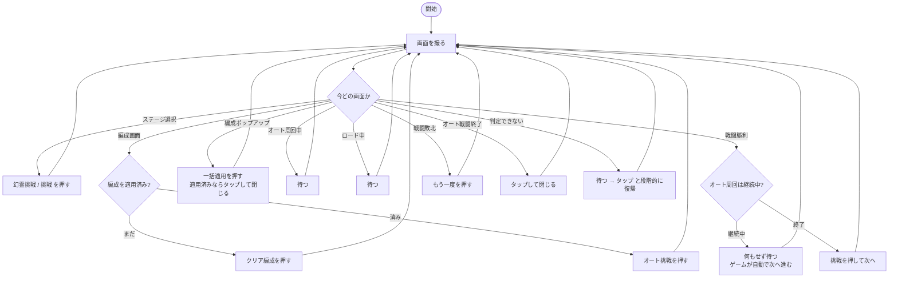

# AFK Journey 幻霊挑戦 自動操作ツール

PC版 AFK Journey の「幻霊挑戦」周回を自動化します。

```bash
afkj doctor     環境を診断する（最初にこれ）
afkj capture    ゲーム画面を撮影する（F9で保存 / F10で終了）
afkj crop       スクショからテンプレート画像を切り出す
afkj check      今の画面に各テンプレートがどれだけ一致するか調べる
afkj run        自動操作を開始する
```

---

## セットアップ

### 1. Python

https://www.python.org/downloads/ から 3.9 以上をインストール。
**PATH に通っていなくても構いません** — `afkj.bat` が実体を自動で探します。

### 2. ライブラリ

```bash
pip install opencv-python numpy pillow
```

### 3. 環境の確認

```bash
afkj doctor
```

Python・ライブラリ・管理者権限・DPI・ゲームウィンドウをまとめて確認します。

> ⚠ **管理者権限が必要です。**
> 通常権限だとクリックがゲームに届きません。ターミナルを右クリック →
> 「管理者として実行」で開いてください。

### 4. 画面の撮影

```bash
afkj capture
```

起動したら**ターミナルに戻らず、そのままゲームをプレイするだけ**です。
画面が切り替わって落ち着いたタイミングを自動で見つけて `screenshots/` に保存します。
**キーを押す必要はありません。**

| 操作 | 動き |
|---|---|
| （何もしない） | 画面が変わるたびに自動で1枚保存 |
| `F9` | 今すぐ1枚撮る |
| `F10` / `Ctrl+C` | 終了 |

- ゲームが**前面にある間だけ**撮影します。別の作業に切り替えている間は何もしないので、
  放っておいて構いません。勝手に前面を奪うこともありません。
- 遷移アニメの途中や戦闘中の演出では撮りません（画面が動いている間は待ちます）。
- 自動保存が邪魔なら `--manual` で F9 のときだけ撮る動作にできます。

撮る画面（1周ぶん）:

| 画面 | 目印 |
|---|---|
| ステージ選択 | 幻霊挑戦 / 挑戦 ボタン |
| 編成画面 | クリア編成・オート挑戦ボタン |
| クリア編成一覧 | 一括適用ボタン |
| 戦闘中 | オート挑戦中… の表示 |
| オート戦闘終了 | 「タップで閉じる」 |
| 戦闘敗北 | もう一度ボタン |
| 戦闘勝利 | 勝利の表示 |
| 想定外のポップアップ | 報酬・レベルアップ・お知らせなど |

### 5. テンプレートの切り出し

```bash
afkj crop
```

ドラッグで範囲を選び `Enter`、ターミナルで名前を入力すると保存されます。
`N`/`P` でスクショを移動、`Q` で終了。

**切り出しのコツ（重要）**

- **変動する要素を含めない。** 戦力値・所持数・残り時間・レベルなどは
  刻々と変わるので、含めると一致しなくなります。
- **文字やアイコンだけを狭く切る。** 実測で、戦力値を含めた
  `幻霊挑戦` ボタンは 0.785（不一致）、ラベル文字だけに切り直すと
  **1.000** になりました。
- **その画面にしかないものを選ぶ。** 他の画面にもある共通パーツだと
  画面を取り違えます。

### 6. 効きの確認

```bash
afkj check
```

今ゲームに映っている画面に対して、各テンプレートの一致度を一覧表示します。
**どの画面でも NG のままなら、そのテンプレートは作り直しが必要**です。
（その画面に写っていないものが NG なのは正常です）

### 7. 実行

```bash
afkj run --dry-run     判定だけしてクリックしない（動作確認用）
afkj run               自動操作を開始
```

初回は必ず `--dry-run` で、画面の判定が正しいか確かめてから本番に移ってください。

主なオプション:

| オプション | 意味 |
|---|---|
| `--entry 幻霊挑戦｜挑戦｜random` | ステージ選択画面で押すボタン（既定: 幻霊挑戦） |
| `--dry-run` | クリックせず判定だけ |
| `--max-battles N` | N回戦ったら終了 |
| `--max-minutes N` | N分で終了 |
| `-v` | 詳細ログ |

### 停止方法

`Ctrl+C` / `F10` / マウスを画面左上角へ移動

---

## 動作の仕組み

毎周回で「画面を撮る → 今どの状態か判定する → その状態に応じて操作する」を
繰り返します。**手順を固定で持たない**のが要点です。



### 状態判定の実測

撮影した24枚の画面すべてで、正しい状態を判定できることを確認済みです。

| 項目 | 結果 |
|---|---|
| 判定の正解率 | **24 / 24** |
| 勝敗の取り違え | **0件** |
| 1画面あたりの判定時間 | 平均 514ms / 最大 1004ms |

### 敗北には2パターンある

オート挑戦のあと、敗北するまでの流れは2通りあります。どちらも対応済みです。

| | 集計画面（オート戦闘終了） | その後 |
|---|---|---|
| 何回か勝ってから敗北 | **出る** → タップして閉じる | 戦闘敗北 → もう一度 |
| 一度も勝てずに敗北 | **出ない** | 戦闘敗北 → もう一度 |

手順を固定で持たない作りなので、集計画面が出れば閉じ、出なければそのまま
敗北処理に進みます。「集計画面のあとは必ず敗北画面が来る」といった
決め打ちをしていないため、片方のパターンで待ちぼうけになりません。

### 勝った回数の数え方（未完成・調査中）

> ⚠ **この集計値は正確ではありません。** 実走では集計画面が「合計2ステージ
> クリア」「合計4ステージクリア」と表示した周回で、こちらの計上が 0 でした。
> 原因を切り分けるため、実行終了時に「看板の観測: 写っていた N回 /
> 写っていなかった M回」を表示するようにしてあります。
>
> **周回の動作そのものには影響しません。** 表示される数値だけの問題です。

勝利画面を数える方式は使っていません。勝利画面は表示時間が短く、
判定の間隔によっては見逃して数え落とすためです。

代わりに、戦闘画面の上部に出る**「幻霊先鋒ステージ N」の看板が変わったか**で
数えます。番号そのものは読まず、看板の見た目の相関で判定します。

**看板が出ていないコマを必ず除くことが重要です。** オート挑戦を押した直後の
約2秒と、勝利後に次のステージへ移る間は、ロード画面や場面転換の演出になって
いて看板が出ていません。これを混ぜて比べると、番号が変わったのか看板が
消えたのか区別がつかず、数え間違いの原因になります。

看板の白い文字の量で、出ているコマだけを選びます。実測（明るさ150超の画素の割合）:

| | 明画素率 |
|---|---|
| 看板あり | 0.067 〜 0.143 |
| 看板なし（ロード中・場面転換中） | すべて 0.000 |

戦闘中の演出が一瞬かぶって誤検出しないよう、変化が続けて確認できたときだけ
1回と数えます。

### 編成画面のボタンに注意

編成画面の下部には左から **← / クリア編成 / オート挑戦 / 戦闘** が並びます。
一番右の緑の「**戦闘**」は手動で戦うためのボタンなので、押してはいけません。
押すべきは中央の「オート挑戦」です。誤って押さないよう、クリック候補から
除外してあります（`afkj/runner.py` の `_on_formation`）。

**勝利と敗北の見分け**は特に重要なので、切り出し方から作り込んであります。
見出しは「戦闘勝利」「戦闘敗北」と先頭2文字が共通なので、
**差異のある「勝利」「敗北」の部分だけ**をテンプレートにしています。

| テンプレート | 勝利画面でのスコア | 敗北画面でのスコア |
|---|---|---|
| `戦闘勝利` | 0.914〜1.000 | 0.354 |
| `戦闘敗北` | 0.422〜0.491 | 0.932〜1.000 |

この作りのおかげで、次のような場面でも自力で復帰します。

| 起きること | どうなるか |
|---|---|
| クリックが空振りした | 画面が変わらないので、次の周回で自然に押し直す |
| 想定外のポップアップが出た | 判定できない画面として、待つ→閉じる→ESC を順に試す |
| 画面遷移が遅れた | 遷移するまで待ってから進む |
| 同じ画面で足踏みしている | 押すボタンを切り替えて抜け出す |
| 戦闘画面が固まった | 画面をタップして先へ促す |
| ゲームを見失った | ウィンドウを取り直して続行する |
| どうしても判定できない | その画面を `debug_screens/` に保存する（テンプレート追加の材料になる） |

旧版はこれらすべてで `sys.exit(1)` して停止していました。

---

## 解像度が変わっても動く

テンプレートを複数の倍率で試して最良の一致を採用します（マルチスケール照合）。
切り出したときの解像度は `templates.json` に記録され、実行時の画面サイズとの
比から倍率の当たりをつけます。

そのため次のどれが起きても動きます。

- PC を買い替えて解像度が変わった
- 全画面 ⇔ ウィンドウを切り替えた（実行中でも追従します）
- ウィンドウをリサイズした
- ディスプレイの拡大率が 100% 以外

実測（旧PCの素材 1590x1052 を各サイズへ変換して照合）:

| 画面サイズ | 0.80以上 | 平均スコア |
|---|---|---|
| 原寸 1590x1052 | 10/10 | 1.000 |
| 1920x1200 | 10/10 | 0.943 |
| 1280x800 | 10/10 | 0.940 |
| 2560x1600 | 10/10 | 0.944 |

---

## ファイル構成

```
afkj_autoplay/
├── afkj.bat            ← ランチャー（Python を自動で探す）
├── afkj.py             ← CLI 本体
├── afkj/
│   ├── window.py       ← ウィンドウ検索・フォーカス・撮影・クリック
│   ├── vision.py       ← 解像度非依存のテンプレート照合
│   ├── capture.py      ← 撮影モード
│   ├── crop.py         ← 切り出しツール
│   ├── states.py       ← 画面状態の定義（UI が変わったらまずここ）
│   └── runner.py       ← 状態機械（自動操作の本体）
├── templates/
│   ├── templates.json  ← 切り出し元の解像度・しきい値
│   └── *.png
├── screenshots/        ← 撮影したスクショ（git 管理外）
└── debug_screens/      ← 判定できなかった画面（git 管理外）
```

---

## ゲームが更新されて動かなくなったら

1. `afkj check` を各画面で実行し、どのテンプレートが効かなくなったか特定する
2. `afkj capture` でその画面を撮り直す
3. `afkj crop` で切り直す（変動する数字を含めないこと）
4. ボタンの配置や手順そのものが変わっていたら `afkj/states.py` を見直す

---

## 設計上の判断

**なぜ画面を前面に出す必要があるのか。**
バックグラウンドのまま操作できれば理想ですが、このゲームは Unity 製で
`PrintWindow` が失敗し（戻り値 0・全面黒）、背面からの撮影ができません。
検証済みです。完全なバックグラウンド動作が必要なら Android エミュレータ +
ADB へ移行するしかありませんが、エミュレータの導入が前提になります。

**自動起動について。**
現状は手動起動のみです。定時実行が必要なら Windows タスクスケジューラから
`afkj.bat run` を呼び出してください。

---

## トラブルシューティング

| 症状 | 対処 |
|---|---|
| クリックしても反応しない | 管理者権限で実行しているか確認（`afkj doctor`） |
| ボタンを見つけてくれない | `afkj check` でスコアを確認。0.7台なら切り直す |
| 誤検知する | `templates.json` の `threshold` を 0.85 などへ上げる |
| 画面を判定できない が続く | `debug_screens/` の画像から新しいテンプレートを切り出す |
| Python が見つからない | `afkj.bat` を使う。それでも駄目なら再インストール |
