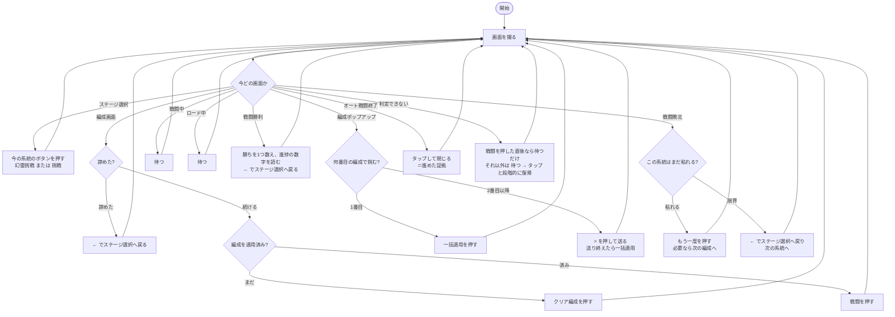

# AFK Journey 先鋒ステージ 自動操作ツール

PC版 AFK Journey の「先鋒ステージ」周回を自動化します。
**幻霊先鋒ステージとシーズン先鋒ステージの両方**を、それぞれ限界まで粘って回します。

```bash
afkj doctor     環境を診断する（最初にこれ）
afkj capture    ゲーム画面を撮影する（F9で保存 / F10で終了）
afkj crop       スクショからテンプレート画像を切り出す
afkj check      今の画面に各テンプレートがどれだけ一致するか調べる
afkj run        自動操作を開始する
```

### 呼び出し方

`afkj` は PATH に入っていないので、**このフォルダ直下で `afkj.bat` を呼びます。**
以下このドキュメントでは `afkj ...` と書きますが、実際の入力はこうなります。

| ターミナル | 入力 | |
|---|---|---|
| PowerShell | `.\afkj.bat run` | 実行確認済み |
| Git Bash | `./afkj.bat run` | 実行確認済み |
| cmd | `afkj.bat run` | |

> カレントディレクトリを実行パスから外す設定（環境変数
> `NoDefaultCurrentDirectoryInExePath`）が入っている環境では、`.\` を
> 付けない `afkj.bat run` は「認識されていません」と言われます。
> 先頭に `.\`（Git Bash なら `./`）を付けてください。

Python 自体が PATH に無くても構いません（`afkj.bat` が実体を探します）。
`.venv\Scripts\python.exe` があればそちらを優先します。

---

## セットアップ

### 1. Python

https://www.python.org/downloads/ から 3.9 以上をインストール。
**PATH に通っていなくても構いません** — `afkj.bat` が実体を自動で探します。

### 2. ライブラリ

```bash
pip install opencv-python numpy pillow
```

### 3. 環境の確認

```bash
afkj doctor
```

Python・ライブラリ・管理者権限・DPI・ゲームウィンドウをまとめて確認します。

> ⚠ **管理者権限が必要です。**
> 通常権限だとクリックがゲームに届きません。ターミナルを右クリック →
> 「管理者として実行」で開いてください。

### 4. 画面の撮影

```bash
afkj capture
```

起動したら**ターミナルに戻らず、そのままゲームをプレイするだけ**です。
画面が切り替わって落ち着いたタイミングを自動で見つけて `screenshots/` に保存します。
**キーを押す必要はありません。**

| 操作 | 動き |
|---|---|
| （何もしない） | 画面が変わるたびに自動で1枚保存 |
| `F9` | 今すぐ1枚撮る |
| `F10` / `Ctrl+C` | 終了 |

- ゲームが**前面にある間だけ**撮影します。別の作業に切り替えている間は何もしないので、
  放っておいて構いません。勝手に前面を奪うこともありません。
- 遷移アニメの途中や戦闘中の演出では撮りません（画面が動いている間は待ちます）。
- 自動保存が邪魔なら `--manual` で F9 のときだけ撮る動作にできます。

撮る画面（1周ぶん）:

| 画面 | 目印 |
|---|---|
| ステージ選択 | 幻霊挑戦 / 挑戦 ボタン |
| 編成画面 | クリア編成・戦闘ボタン・左下の ← |
| クリア編成一覧 | 一括適用ボタン・右端の > |
| 戦闘中 | 一時停止・歯車ボタン |
| オート戦闘終了 | 「タップで閉じる」（オート挑戦を使ったときだけ出る） |
| 戦闘敗北 | もう一度ボタン |
| 戦闘勝利 | 勝利の表示 |
| 想定外のポップアップ | 報酬・レベルアップ・お知らせなど |

### 5. テンプレートの切り出し

```bash
afkj crop
```

ドラッグで範囲を選び `Enter`、ターミナルで名前を入力すると保存されます。
`N`/`P` でスクショを移動、`Q` で終了。

**切り出しのコツ（重要）**

- **変動する要素を含めない。** 戦力値・所持数・残り時間・レベルなどは
  刻々と変わるので、含めると一致しなくなります。
- **文字やアイコンだけを狭く切る。** 実測で、戦力値を含めた
  `幻霊挑戦` ボタンは 0.785（不一致）、ラベル文字だけに切り直すと
  **1.000** になりました。
- **その画面にしかないものを選ぶ。** 他の画面にもある共通パーツだと
  画面を取り違えます。

### 6. 効きの確認

```bash
afkj check
```

今ゲームに映っている画面に対して、各テンプレートの一致度を一覧表示します。
**どの画面でも NG のままなら、そのテンプレートは作り直しが必要**です。
（その画面に写っていないものが NG なのは正常です）

### 7. 実行

```bash
afkj run --dry-run     判定だけしてクリックしない（動作確認用）
afkj run               自動操作を開始
```

初回は必ず `--dry-run` で、画面の判定が正しいか確かめてから本番に移ってください。

主なオプション:

| オプション | 意味 |
|---|---|
| `--modes 幻霊,シーズン` | 回す系統と順番。前を限界まで粘ってから次へ（既定: `幻霊,シーズン`） |
| `--attempts 3,2,1,1,1` | 1番目のクリア編成で3回、2番目で2回、3〜5番目で1回ずつ試して諦める（既定: `3,2,1,1,1`） |
| `--dry-run` | クリックせず判定だけ |
| `--record` | 状態が変わるたびに画面を `debug_screens/` に保存 |
| `--max-battles N` | N回戦ったら終了 |
| `--max-minutes N` | N分で終了 |
| `-v` | 詳細ログ |

例:

```bash
afkj run                             幻霊を限界まで → シーズンを限界まで
afkj run --modes シーズン              シーズンだけを限界まで
afkj run --attempts 2,1,1            浅めに切り上げる（1ステージあたり最大4敗）
afkj run --attempts 3                1番目の編成だけで3回（編成を切り替えない）
```

### 停止方法

`Ctrl+C` / `F10` / マウスを画面左上角へ移動

---

## 先鋒ステージは2系統ある

先鋒ステージは **幻霊先鋒ステージ M** と **シーズン先鋒ステージ N** の2つから成り、
進捗はそれぞれ独立しています。ステージ選択画面のボタンで分岐します。

| ボタン | 入る先 |
|---|---|
| 幻霊挑戦（左・白） | 幻霊先鋒ステージ M |
| 挑戦（右・緑） | シーズン先鋒ステージ N |

画面上に出ている先鋒ステージの全体進捗は `(M-1) + (N-1)` です。

このツールは**両方**を対象にします。片方を限界まで粘ってから、もう片方へ移ります。
どちらも粘り切ったところで実行を終えます（`--modes` で順番の変更・片方だけの指定も可）。

ボタンの押し分けを間違えると別系統を回してしまうため、ここでは
**フォールバックしません**（幻霊挑戦が見つからないときに挑戦を押すことはしない）。
実測では 1920x1200 のステージ選択画面で `幻霊挑戦_btn` が x=699 に 0.988、
`挑戦_btn` が x=1266 に 0.937 で当たり、取り違えは起きていません。

### 片方をクリアし終えてボタンが1つになった場合

幻霊先鋒ステージをクリアし終えると「幻霊挑戦」ボタンが消え、ステージ選択には
中央に横長の「挑戦」ボタンが1つだけ出ます。入った先の流れは2系統あるときと同じです。

既定の順番では幻霊から回すので、ツールは幻霊挑戦を探します。このとき
**「幻霊挑戦は無いが挑戦は見える」が3回続いたら、幻霊は無いものとして飛ばし**、
シーズンへ移ります。上のフォールバック禁止とは矛盾しません。一瞬の見落としで
系統を取り違えないよう、1回だけの見落としでは判断しないためです。最後の集計には
`幻霊先鋒ステージ: … / ステージ選択にボタンが無いため回さず（クリア済みとみなした）`
と出ます。

実測（1907x1197 の1ボタン画面）: `挑戦_btn` が中央 x=940 に 0.924 で当たり、
`幻霊挑戦_btn` は 0.495 で当たりません。既存のテンプレートのままで足ります。

---

## 「限界まで頑張り切る」とは

1つのステージに対して、クリア編成を切り替えながら粘ります。

```
1番目のクリア編成で X回 挑む
  → それでも負ける → 「>」で 2番目のクリア編成に切り替えて Y回
     → それでも負ける → この系統は諦めて、次の系統へ
```

回数は `--attempts X,Y,...` で指定します（既定 `3,2,1,1,1`）。

**値の決め方**（プレイ上の経験則）:

- クリア編成の数はステージによって違う。1〜2個しかないステージもあれば、5〜6個
  あるステージもある
- 勝てるステージは浅い編成で勝てることが多い
- 同じ編成を3回以上繰り返しても無駄。3回で勝てないものは5回でも勝てない

つまり**深く粘るより広く浅く**が有利です。ただし浅い編成ほど当たりが多いだけで、
深い編成の**費用そのものは安い**（下の実測）ので、既定は打ち切りを浅くしすぎない
`3,2,1,1,1` にしてあります。1ステージあたり最大8敗で切り上げます。

実測①（2026-08-11、`--attempts 2,1,1,1,1` で1時間14分・27敗・進捗 +88）:

| 使った編成 | 適用回数 | そのあとクリアできた |
|---|---|---|
| 1番目 | 15 | 3 |
| 2番目 | 4 | 1 |
| 3番目 | 3 | 0 |
| 4番目 | 3 | 1 |
| 5番目 | 2 | 0 |

実測②（2026-08-13、`--attempts 3,2,1,1,1` で2時間14分・68敗・進捗 267→404 = **+137**）:

| 使った編成 | 適用回数 | そのあとクリアできた | 消費時間 |
|---|---|---|---|
| 1番目 | 89 | 45 (51%) | 105分 |
| 2番目 | 19 | 8 (42%) | 20分 |
| 3番目 | 5 | 3 (60%) | 6.5分 |
| 4番目 | 2 | 0 | 1.4分 |
| 5番目 | 2 | 0 | 0.9分 |

4番目・5番目は 0/4 でしたが、**両方合わせて2.3分**（全体の1.7%）しか使っていません。
深追いに到達すること自体が稀なので、候補を並べておく費用はほぼ無視できます。
逆に浅く切り上げると、当たりのある3番目まで届かなくなります。

> 2回ぶんを合わせると 3番目以降の当たりは **4/17**（3番目だけなら 3/8）。
> 少ないですが 0 ではないので、**「3個目以降は無駄」とまでは言えません。**
> 3番目を既定から外さなかったのはこのためです。

**ステージを1つ進めるたびに、1番目のクリア編成から当て直します。**
戦闘は「オート挑戦」ではなく「**戦闘**」で1戦ずつ行い、勝ったら勝利画面の
`←` でステージ選択へ戻って、次のステージのクリア編成を一括適用します。

オート挑戦をやめたのは、勝った編成を引き継いで次のステージに挑むより、
そのステージのクリア履歴を当てたほうがずっと勝つからです。

実測（2026-10-05、オート挑戦で2時間・進捗 315→411）:

| 次のステージに挑んだ編成 | 勝率 |
|---|---|
| 前のステージで勝った編成をそのまま（オート挑戦の引き継ぎ） | **27/82 = 33%** |
| そのステージのクリア編成1番目（当て直した1回目） | **50/64 = 78%** |

引き継いだ編成で負ける戦闘は1回あたり中央値で約22秒かかり、それが進めた
ステージの3分の2で起きていました。当て直しの手間（ステージ選択から
戦闘開始まで）は実測で約9秒です。

> 1戦ずつの流れ（勝利画面の `←` → ステージ選択）は、まだ実走で確かめていません。
> 以前の実行で、勝利画面をタップしたときにステージ選択へ戻ったこと（3回）は
> 観測しています。初回は `--record` を付けて走らせてください。

進めたかどうかは**勝利画面を観測できたか**で判断し、根拠をログに残します。
1戦ずつ戦う場合、勝利画面は `←` を押すまで残るので見逃しません。

諦める理由は2通りあり、ログにどちらかが残ります。

| ログ | 意味 |
|---|---|
| `クリア編成 5回＋3回＋2回 を試し切った` | `--attempts` に書いた編成を全部使った（ゲーム側にはまだ次の編成があるかもしれない） |
| `クリア編成が N個で尽きた` | `>` が見つからない＝ゲーム側の編成が本当に尽きた |

前者は**こちらの指定が上限**なので、「本当に限界まで」やらせたいなら
`--attempts 5,3,2,2,2` のように候補を多めに並べてください。実在する数を
超えた分は `>` が見つからない時点で自動的に止まります。

> 実測: `2,1,1,1,1` でも `3,2,1,1,1` でも、どちらの系統も5番目まで到達して
> 「試し切った」で諦めました（`>` は最後まで見つかっていた）。つまり壁に
> なっているステージには**5個以上のクリア編成がありました**。
> 6番目以降まで伸ばすかは未検証ですが、4・5番目が 0/4 だったことを踏まえて
> 既定は5個までに留めています。

---

## 動作の仕組み

毎周回で「画面を撮る → 今どの状態か判定する → その状態に応じて操作する」を
繰り返します。**手順を固定で持たない**のが要点です。


```mermaid
flowchart TD
    A([開始]) --> B[画面を撮る]
    B --> C{今どの画面か}
    C -->|ステージ選択| D[今の系統のボタンを押す<br/>幻霊挑戦 または 挑戦]
    C -->|編成画面| N{諦めた?}
    N -->|諦めた| N0[← でステージ選択へ戻る]
    N -->|続ける| N3{編成を適用済み?}
    N3 -->|まだ| N1[クリア編成を押す]
    N3 -->|済み| N2[戦闘を押す]
    C -->|編成ポップアップ| E{何番目の編成で挑む?}
    E -->|1番目| E1[一括適用を押す]
    E -->|2番目以降| E2[> を押して送る<br/>送り終えたら一括適用]
    C -->|戦闘中| F[待つ]
    C -->|ロード中| G[待つ]
    C -->|戦闘勝利| J[勝ちを1つ数え、進捗の数字を読む<br/>← でステージ選択へ戻る]
    C -->|戦闘敗北| K{この系統はまだ粘れる?}
    K -->|粘れる| K1[もう一度を押す<br/>必要なら次の編成へ]
    K -->|限界| K2[← でステージ選択へ戻り<br/>次の系統へ]
    C -->|オート戦闘終了| L[タップして閉じる<br/>＝進めた証拠]
    C -->|判定できない| M[戦闘を押した直後なら待つだけ<br/>それ以外は 待つ → タップ と段階的に復帰]
    D --> B
    N0 --> B
    N1 --> B
    N2 --> B
    E1 --> B
    E2 --> B
    F --> B
    G --> B
    J --> B
    K1 --> B
    K2 --> B
    L --> B
    M --> B
```

### 状態判定の実測

撮影した24枚の画面すべてで、正しい状態を判定できることを確認済みです。

| 項目 | 結果 |
|---|---|
| 判定の正解率 | **24 / 24** |
| 勝敗の取り違え | **0件** |
| 1画面あたりの判定時間 | 平均 514ms / 最大 1004ms |

### 粘り方の検証状況

**確認できていること（記録した実画面を状態機械に食わせて再生）**

※ この節の検証はオート挑戦を使っていたころのものです。1戦ずつの流れは、
撮影済みの画面（ステージ選択・編成・ポップアップ・戦闘・勝利・敗北）を
同じ方法で再生し、勝ち → `←` → ステージ選択 → 1番目の編成を当て直す →
戦闘、の順に押すことを確かめました。勝利画面・敗北画面が続いても
勝ち負けは1回ずつしか数えません。

`debug_screens/` に残っている実物の画面を順に食わせ、押そうとしたボタンを
記録して確かめました。クリックはしていません。

| 試したこと | 結果 |
|---|---|
| 負け続けたとき（`--attempts 2,1`） | 一括適用 ×2 → `>`→一括適用 ×1 → `←` で戻る → 挑戦（シーズン）へ |
| 両系統を諦めたとき | 「すべての系統を限界まで回し切った」で停止 |
| 勝ってから負けたとき | 集計画面・勝利画面の観測を根拠に1番目の編成へ戻す |
| `--modes シーズン` | ステージ選択で `挑戦` だけを押す（幻霊挑戦は押さない） |
| 幻霊をクリアし終えた1ボタン画面（既定の順番） | 幻霊挑戦なしを3回確認 → 幻霊を飛ばす → `挑戦` でシーズンへ |
| `次の編成_btn` が未登録 | 2番目が必要になった時点で諦め、ポップアップを閉じて戻る |
| 敗北画面が数コマ続く | 負けの計上と編成の切り替えは最初の1コマだけ |
| 敗北 → 判定不能 → 敗北 と揺れる | 1回として扱う（間に戦闘を観測していないため）。実測で 3コマ → 負け1回・挑戦1回目 |

**実走で確認できたこと**（`--record` 付きで走らせ、ログと録画で確認）

| 前提だったこと | 実測 |
|---|---|
| 敗北画面の `←` でステージ選択に戻れる | **戻れた。** `戻る_btn` を押した2秒後にステージ選択を判定し、次の系統へ移行 |
| ポップアップを開き直すと1番目の編成に戻る | **戻る。** 開いた瞬間の5枚が相関 **1.000** で完全一致 |
| `>` が実際に編成を切り替えている | **切り替わっている。** 適用直後の盤面は同じ番号どうし 0.87〜0.93 / 違う番号どうし 0.65〜0.82 |
| シーズン先鋒でも同じ位置に `>` と `←` が出る | **出た。** シーズン側でも `>` を4回まで送り、`←` で戻れた |

1時間14分の実走（27敗）と5分の実走（8敗）で、誤った数え直し 0件・
敗北の二重計上 0件・押すボタンの取り違え 0件でした。

### 戦闘中の見分け方

オート挑戦のときは画面下の「オート挑戦中…」で戦闘中を見分けていましたが、
1戦ずつの戦闘ではこの表示が出ません。代わりに戦闘画面の
**一時停止ボタン**（`一時停止_btn`）と**歯車ボタン**（`戦闘設定_btn`）で見分けます。

| テンプレート | 戦闘画面 | 他の画面での最大 |
|---|---|---|
| `一時停止_btn`（しきい値 0.88） | 0.926〜0.975（4枚） | 0.818（勝利画面の裏に透ける。勝利が優先されるので問題なし） |
| `戦闘設定_btn`（しきい値 0.85） | 0.90〜0.96（3枚。1枚は 0.656） | 0.696 |

> どちらも撮影済みの**オート挑戦の**戦闘画面から切り出したものです。1戦ずつの
> 戦闘でも同じボタンが出ているかは未確認です。

そのため「戦闘」を押してから150秒までは、判定できない画面も戦闘中とみなし、
**タップせずに待ちます**（戦闘中にタップすると英雄のカードを触るため）。
このとき画面を最大3枚 `debug_screens/battle_unknown_*.png` に保存するので、
判定できていなければそこから切り出し直してください。

### クリアしたステージ数の数え方

勝利画面1つにつき1ステージ数えます。あわせて、勝利画面に出ている

```
先鋒ステージ進捗   15 ≫ 16
```

の2つを読み取り、実行の最初と最後の進捗を記録します（`afkj/digits.py`）。
撮影済みの勝利画面5枚（11≫12 〜 15≫16）はすべて読めて、前後もつながっていました。

> オート挑戦を使っていたころは、オート戦闘終了（集計）画面に出る
> `161 ≫ 165` の差をその周回のクリア数にしていました。勝利画面は表示が短く
> 見逃すことがあったためです。集計画面と勝利画面では帯の位置が違うだけで、
> 読み方は同じです。

> **以前の方式（看板の変化を数える）は廃止しました。**
> 戦闘画面の上部に出る「幻霊先鋒ステージ N」の看板が変わった回数で数えて
> いましたが、**今の版の戦闘画面には看板が出ていません。** あの位置に写って
> いたのは背景の街並みで、カメラが動くだけで数字が増えていました。
>
> | 実測 | ゲームの表示 | 旧方式の計上 |
> |---|---|---|
> | ある周回 | 合計4ステージクリア（54 → 58） | 9回 |
> | ある周回 | 進捗 77 → 165（88ステージ） | 154回 |
> | ある周回 | **0ステージ**（勝利画面も集計画面も出ず） | 3回 |
>
> 明るさで「看板が出ているか」を判別していた部分も機能していませんでした
> （看板なしの背景で明画素率 0.120〜0.276、しきい値 0.03 を素通り）。

**読み方**（`afkj/digits.py`）

左の数字は白、右は緑で塗りが違いますが、**輪郭の暗い縁取りは共通**なので、
暗い画素だけを取り出した2値の形で照合します。これで数字の型は0〜9の1組で
足ります。桁は隣とくっついていて切り分けられないため、10個の型を領域全体に
走査し、当たりの強い順に採って重なるものを捨てます。

最後に必ず**インクを覆えたか**を確かめます。桁を1つ取り落とすと 91 が 1 に
化けますが、覆えていない塊が残るので気づけます。覆いきれなければ
**読まずに棄権**します。誤った数字を出すより、読めなかったと言うほうが安全です。

実測（記録済みの集計画面58枚）:

| | 結果 |
|---|---|
| 値が分かっている20枚 | **20枚とも正解 / 誤読 0** |
| 全58枚 | 56枚を読み取り、2枚は棄権（演出の粒子が数字に重なる） |
| 読めた56枚の連続性 | すべて前後がつながっていた（ある画面の左の数字＝前の画面の右の数字） |

実行終了時に `先鋒ステージ進捗: 77 → 165 (+88) / 勝利画面 90回中 88回 読み取り`
の形で表示します。棄権した回数も出るので、読み取りの調子が落ちたら気づけます。

数字の型は `templates/digits/0.png` 〜 `9.png` です。ゲームの更新で書体が
変わったら、`debug_screens/` に残った勝利画面から切り直してください。

### 編成の切り替えと諦めに使うテンプレート

粘り方の制御のために2つのテンプレートを追加してあります。どちらも
`debug_screens/` に残っていた実物の画面（1920x1200）から切り出したものです。

| テンプレート | 何のボタンか | 実測スコア |
|---|---|---|
| `次の編成_btn` | 編成ポップアップ右端の `>` | 編成ポップアップ 6枚すべてで **0.977〜0.978** / 他の45枚では最大 0.713 |
| `戻る_btn` | 画面左下の `←` | 敗北画面 0.975 / 編成画面 0.998 / 無関係な画面では最大 0.778 |

`←` は勝利画面・敗北画面・編成画面・ステージ選択画面のどれにも同じ見た目で出ます。
そのため**押すのは「勝った」か「諦めた」と決めたときだけ**に限っています
（勝利画面での実測 0.975）。

どちらかが未登録のときは、起動時に「何ができなくなるか」を警告します。

| 欠けているもの | 動作 |
|---|---|
| `次の編成_btn` | 1番目のクリア編成だけで再挑戦（編成を切り替えない） |
| `戻る_btn` | ステージ選択へ戻れないので、諦めた時点で実行を終了 |

半透明の `>` は背景の影響を受けやすいので、効かなくなったら
`afkj check` でスコアを見て `afkj crop` で切り直してください。

### 編成画面のボタンに注意

編成画面の下部には左から **← / クリア編成 / オート挑戦 / 戦闘** が並びます。
押すのは一番右の緑の「**戦闘**」です。中央の「オート挑戦」は、勝つと編成を
引き継いだまま次のステージへ進んでしまうので、クリック候補から除外してあります
（`afkj/runner.py` の `_on_formation`）。

**編成画面では「画面をタップして閉じる」動作をしません。**
タップ位置（画面中央の下寄り）が「戦闘」に近く、編成を当てる前に戦闘を
始めてしまう恐れがあるからです。諦めて戻るときは `←` が見つかるまで待ちます
（90秒待っても戻れなければ、黙って回り続けずに実行を終えます）。

**勝利と敗北の見分け**は特に重要なので、切り出し方から作り込んであります。
見出しは「戦闘勝利」「戦闘敗北」と先頭2文字が共通なので、
**差異のある「勝利」「敗北」の部分だけ**をテンプレートにしています。

| テンプレート | 勝利画面でのスコア | 敗北画面でのスコア |
|---|---|---|
| `戦闘勝利` | 0.914〜1.000 | 0.354 |
| `戦闘敗北` | 0.422〜0.491 | 0.932〜1.000 |

この作りのおかげで、次のような場面でも自力で復帰します。

| 起きること | どうなるか |
|---|---|
| クリックが空振りした | 画面が変わらないので、次の周回で自然に押し直す |
| 想定外のポップアップが出た | 判定できない画面として、待つ→閉じる→ESC を順に試す |
| 画面遷移が遅れた | 遷移するまで待ってから進む |
| 同じ画面で足踏みしている | 押すボタンを切り替えて抜け出す |
| 戦闘画面が固まった | 画面をタップして先へ促す |
| ゲームを見失った | ウィンドウを取り直して続行する |
| どうしても判定できない | その画面を `debug_screens/` に保存する（テンプレート追加の材料になる） |

旧版はこれらすべてで `sys.exit(1)` して停止していました。

---

## 解像度が変わっても動く

テンプレートを複数の倍率で試して最良の一致を採用します（マルチスケール照合）。
切り出したときの解像度は `templates.json` に記録され、実行時の画面サイズとの
比から倍率の当たりをつけます。

そのため次のどれが起きても動きます。

- PC を買い替えて解像度が変わった
- 全画面 ⇔ ウィンドウを切り替えた（実行中でも追従します）
- ウィンドウをリサイズした
- ディスプレイの拡大率が 100% 以外

実測（旧PCの素材 1590x1052 を各サイズへ変換して照合）:

| 画面サイズ | 0.80以上 | 平均スコア |
|---|---|---|
| 原寸 1590x1052 | 10/10 | 1.000 |
| 1920x1200 | 10/10 | 0.943 |
| 1280x800 | 10/10 | 0.940 |
| 2560x1600 | 10/10 | 0.944 |

---

## ファイル構成

```
afkj_autoplay/
├── afkj.bat            ← ランチャー（Python を自動で探す）
├── afkj.py             ← CLI 本体
├── afkj/
│   ├── window.py       ← ウィンドウ検索・フォーカス・撮影・クリック
│   ├── vision.py       ← 解像度非依存のテンプレート照合
│   ├── capture.py      ← 撮影モード
│   ├── crop.py         ← 切り出しツール
│   ├── states.py       ← 画面状態の定義（UI が変わったらまずここ）
│   ├── digits.py       ← 勝利画面の「先鋒ステージ進捗」を読む
│   └── runner.py       ← 状態機械（自動操作の本体）
├── templates/
│   ├── templates.json  ← 切り出し元の解像度・しきい値
│   ├── digits/         ← 数字の型 0.png〜9.png（進捗の読み取り用）
│   └── *.png
├── screenshots/        ← 撮影したスクショ（git 管理外）
└── debug_screens/      ← 判定できなかった画面（git 管理外）
```

---

## ゲームが更新されて動かなくなったら

1. `afkj check` を各画面で実行し、どのテンプレートが効かなくなったか特定する
2. `afkj capture` でその画面を撮り直す
3. `afkj crop` で切り直す（変動する数字を含めないこと）
4. ボタンの配置や手順そのものが変わっていたら `afkj/states.py` を見直す

---

## 設計上の判断

**なぜ画面を前面に出す必要があるのか。**
バックグラウンドのまま操作できれば理想ですが、このゲームは Unity 製で
`PrintWindow` が失敗し（戻り値 0・全面黒）、背面からの撮影ができません。
検証済みです。完全なバックグラウンド動作が必要なら Android エミュレータ +
ADB へ移行するしかありませんが、エミュレータの導入が前提になります。

**自動起動について。**
現状は手動起動のみです。定時実行が必要なら Windows タスクスケジューラから
`afkj.bat run` を呼び出してください。

---

## トラブルシューティング

| 症状 | 対処 |
|---|---|
| クリックしても反応しない | 管理者権限で実行しているか確認（`afkj doctor`） |
| ボタンを見つけてくれない | `afkj check` でスコアを確認。0.7台なら切り直す |
| 誤検知する | `templates.json` の `threshold` を 0.85 などへ上げる |
| 画面を判定できない が続く | `debug_screens/` の画像から新しいテンプレートを切り出す |
| Python が見つからない | `afkj.bat` を使う。それでも駄目なら再インストール |
